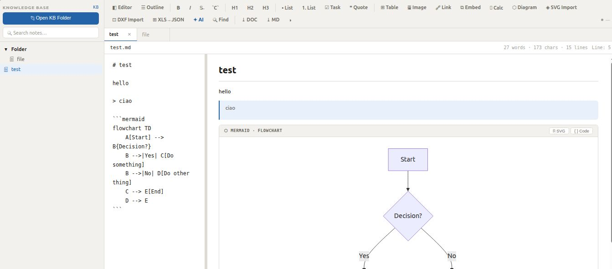

[](https://www.buymeacoffee.com/adegard)

# Knowledge Base — Android and HTML versions

A native Android (Kotlin + Jetpack Compose) port of the
[adegard/KnowledgeBase](https://github.com/adegard/KnowledgeBase) web app —
a folder-based knowledge base with a Markdown editor, live preview,
multiple tabs, full-text search, file management and dark/light themes.

Try it in browser! 
https://adegard.github.io/KnowledgeBase/kb_improved_SVG.html



## Features

- **Knowledge base folder selection** — pick any folder on the device via the
  Storage Access Framework (SAF); everything inside stays as plain `.md` files.
- **Markdown editor** with live WebView preview (editor/preview split pane,
  draggable splitter).
- **Formatting toolbar** — bold, italic, strikethrough, inline code, H1–H3,
  bullet/numbered lists, task checkboxes, blockquotes, tables, links, images.
- **Tabs** — open several notes at once, dirty-indicator dots, close buttons.
- **Auto-save** with visual status (saving / saved / error).
- **Find & replace** including replace-one and replace-all.
- **Outline panel** for navigating document headings.
- **Full-text search** across all notes in the knowledge base.
- **File management** — create files & folders, rename, move, delete
  (long-press a tree item).
- **Rich rendering** — the preview runsp `marked` for Markdown, KaTeX for Math
  and Mermaid for diagrams (loaded from CDN, with an offline fallback parser).
- **Dark / Light theme** toggle, persisted across launches.
- Sample knowledge base included for a quick start.

## Project structure

```
app/src/main/java/com/knowledgebase/app/
├── KnowledgeBaseApp.kt        Application (DI-lite)
├── MainActivity.kt            Navigation drawer + folder picker + dialogs
├── data/
│   ├── model/                 Note, TreeNode, KnowledgeBase
│   └── repository/            FileRepository (SAF), PreferencesRepository
├── ui/
│   ├── components/            Sidebar, TabBar, EditorToolbar,
│   │                          EditorPanels, Dialogs
│   ├── screens/               EditorScreen, FolderPickerScreen
│   ├── theme/                 Light/Dark Material3 theme
│   └── viewmodel/             MainViewModel (tree, tabs, autosave, search)
└── util/                      MarkdownFormatUtil, MarkdownRendererHelper
```

## Build

```bash
# Android SDK (compileSdk 35) + JDK 17+ required
./gradlew assembleDebug
# APK output:
app/build/outputs/apk/debug/app-debug.apk
```

Install on a connected device:

```bash
adb install app/build/outputs/apk/debug/app-debug.apk
```

## Note on Room

The app intentionally avoids Room/annotation processors so it builds anywhere;
persistence uses plain files (the notes) plus a small JSON preferences store
for open tabs and settings. This keeps the APK lean and lets a knowledge base
be any normal folder on the device.

## License

MIT — adapted from the original [adegard/KnowledgeBase](https://github.com/adegard/KnowledgeBase).

---
For an overview of all my other projects, see https://adegard.github.io/blog/
